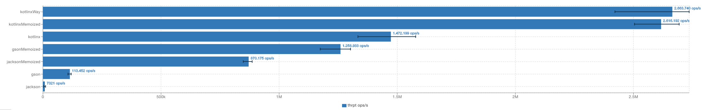

# BENCHMARKING SERDE LIBRARIES IN JVM

Benchmark most important libraries for Serialize/Deserialize in the jvm

* [Jackson 2.14.1](https://github.com/FasterXML/jackson-core)
* [Kotlinx Serialization 1.4.1](https://github.com/Kotlin/kotlinx.serialization)
* [GSON 2.10](https://github.com/google/gson)

Using [JMH 1.36](https://github.com/openjdk/jmh) as Benchmark tool

## HOW TO USE
```
./gradlew benchmark
```

## REPORT

```
Benchmark                              Mode  Cnt        Score        Error  Units
DeserializeBenchmark.gson             thrpt    5    69894.573 ± 128595.241  ops/s
DeserializeBenchmark.gsonMemoized     thrpt    5  1522166.825 ±  60386.010  ops/s
DeserializeBenchmark.jackson          thrpt    5    22026.399 ±    589.403  ops/s
DeserializeBenchmark.jacksonMemoized  thrpt    5   974237.538 ±   9846.925  ops/s
DeserializeBenchmark.kotlinx          thrpt    5  1789183.875 ±  74900.579  ops/s
DeserializeBenchmark.kotlinxMemoized  thrpt    5  2796742.540 ±  83919.359  ops/s
DeserializeBenchmark.kotlinxWay       thrpt    5  2842240.038 ±  69050.209  ops/s
SerializeBenchmark.gson               thrpt    5   149364.917 ±   1333.079  ops/s
SerializeBenchmark.gsonMemoized       thrpt    5  1417857.711 ±   9613.048  ops/s
SerializeBenchmark.jackson            thrpt    5    16149.307 ±    423.247  ops/s
SerializeBenchmark.jacksonMemoized    thrpt    5  3143054.962 ±  57989.535  ops/s
SerializeBenchmark.kotlinx            thrpt    5  2290690.642 ± 724352.666  ops/s
SerializeBenchmark.kotlinxMemoized    thrpt    5  4838642.669 ± 230345.836  ops/s
SerializeBenchmark.kotlinxWay         thrpt    5  4868722.910 ± 181528.326  ops/s

```
### DESERIALIZE


### SERIALIZE

