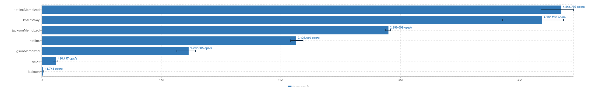

# BENCHMARKING SERDE LIBRARIES IN JVM

Benchmark most important libraries for Serialize/Deserialize in the jvm
* 
* Jackson 2.13.3
* Kotlinx Serialization 1.4.0-RC
* GSON 2.9.0

Using JMH 1.35 as Benchmark tool

## HOW TO USE
```
./gradlew benchmark
```

## REPORT

```
Benchmark                              Mode  Cnt        Score        Error  Units
DeserializeBenchmark.gson             thrpt    5   129361.430 ±   2531.972  ops/s
DeserializeBenchmark.gsonMemoized     thrpt    5  1208553.710 ± 501683.912  ops/s
DeserializeBenchmark.jackson          thrpt    5    18014.228 ±  12176.717  ops/s
DeserializeBenchmark.jacksonMemoized  thrpt    5   758674.503 ± 339722.093  ops/s
DeserializeBenchmark.kotlinx          thrpt    5  1504983.197 ± 314930.415  ops/s
DeserializeBenchmark.kotlinxMemoized  thrpt    5  2702652.063 ± 353885.916  ops/s
SerializeBenchmark.gson               thrpt    5   119395.138 ±   3060.617  ops/s
SerializeBenchmark.gsonMemoized       thrpt    5  1264686.379 ±  28106.480  ops/s
SerializeBenchmark.jackson            thrpt    5    16952.335 ±    492.238  ops/s
SerializeBenchmark.jacksonMemoized    thrpt    5  3178720.839 ±  56194.113  ops/s
SerializeBenchmark.kotlinx            thrpt    5  2067696.279 ± 294422.107  ops/s
SerializeBenchmark.kotlinxMemoized    thrpt    5  4908882.276 ± 230439.667  ops/s

```
### DESERIALIZE


### SERIALIZE

